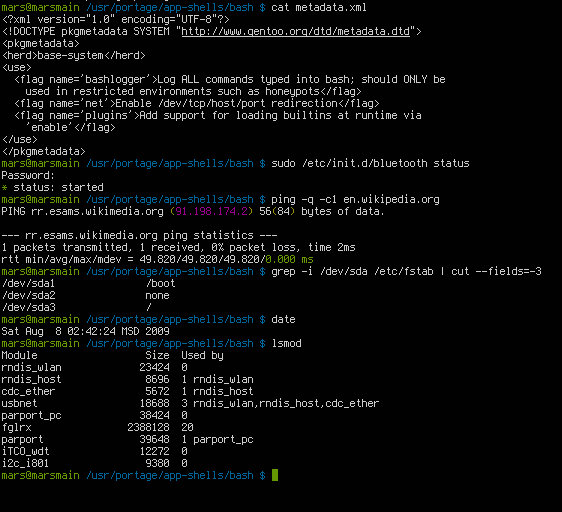
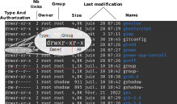

# The basics: The computer and the program   


## At the beginning was the Shell :

**A computer program that exposes an operating system's services to a human user or other programs.** ([Wikipedia - Sep. 2023](https://en.wikipedia.org/wiki/Shell_(computing))) (also named _a terminal_)



### Some Vocabulary: 

- **Prompt**: A command prompt (or just prompt) state in the command-line interface indicating readiness to accept commands. 
- **Command**: an instruction received via an external interface that directs the behavior of a computer program. In other terms, a call to a program with potentially specific attributes.


## First _BASH_ Commands.

[Bash](https://en.wikipedia.org/wiki/Bash_(Unix_shell)) is the most popular Unix/Linux shell, available by default on most Linux distribution. 
It is also natively supported on Apple, and versions of Bash can be installed with tools like [MinGW](https://en.wikipedia.org/wiki/MinGW) on Windows 

However, most of the commands presented here exist in other Shell or have some equivalents.

### The File System

First of all, some commands allow a user to navigate in file systems et interact with it.

- __ls__ - list directory elements
- __cd__ - change directory
- __cat__ - read all a text file
- __more__ - read a text file step by step
- __touch__ - touch a resource (create it)
- __nano__ - edit a text file
- __rm__ - remove a file (permanently)
- __mkdir__ - create (make) a directory
- __rmdir__ - remove a directory
- __mv__ - move a resource
- __cp__ - copy-paste a file
- __clear__ - clear your promt

Most of this commands manipulate paths - a description of where to find a resource on the computer -.

- __/__ - the root directory in Linux system - example: `du /bin/bash` (du - estimate file space usage)
- __.__ - the current directory - example: `mkdir ./workspace`
- __..__ - the parent directory - example: `cd ../../media`
- __~__ - the user directory (home) - example: `cd ~/Documents`
- **CApitAl Letters maTer** - example: `cd ~/Documents` $\neq$ `cd ~/documents`


### Mastering Commands

Most of the commands accept arguments and options. With a simplistic vision, the argument gives a target to the command execution, while options permit the user to change the context execution of the command. 

Classical syntax: `command --option -o argument` - example: `ls -a ~`

Some commands permit manipulating the command collection.

- __man__ - command and library manuel - example: `man cp`
- __apropos__ - search in the manuels - example: `apropos search`
- __whereis__ - find the location of a resource - example: `whereis python3`
- __alias__ - create our own command - example: `alias listall="ls -a"`

### Some triks : 

- _tabulation_: auto-complete the command line or list the possibilities
- _!xx_: run again the last command starting with `xx`
- _ctrl-r_: search for a command in command history
- _Q_: quit a runnig program (in most programs)
- _ctr-c_: terminate a running program
- _~/.bashrc_: file: user configuration routine


## Users session

On Linux, users are clearly identified everywhere.
All resources have owners, and users can be limited in their capacities on the system.
Users can be artificially set, they are not necessarily real human beings.


### session

A session is an active connection to a system or program.

- __who__ - list the open session in a computer
- __su__ : start a new session as a specific user - example: `su bob`
- __ssh__ - open a session in a distant computer following the ssh protocol

A user session is associate to an environement.
computer system or set of systems in which a computer program or software component is deployed and executed ([Wikipedia Sept. 2023](https://en.wikipedia.org/wiki/Deployment_environment)).

- __env__ - list the environment variable.
- __$__ - access a variable - example: `echo $PATH`
- __$PATH__ - list of all directories where _bash_ search the commands.
- __$SHELL__ - the current shell interpreter.
- __$USER__ - the user name.
- __export__ - create a new variable - example: `export MYBIN=~/bin`
- __~/.bashrc__ (file): user configuration commands.

### User, Group and Rules

_Users_ are structured with _groups_.
Users as groups have a name and a number
A _user_ is defined with a primary _group_, its main group, but a _group_ can include several users.
The files `/etc/passwd` and `/etc/group` record that information, among others.
List them with `cat` for example (`cat /etc/passwd` and `cat /etc/group`).


Specific access is associated to each resource on the computer with _r_: read $\quad$ _w_: write $\quad$ _x_: executed/open.
The triple authorization can be different for the _user_ owner, the _group_ owner, or  _all_ the others.
List command with the `-l` option gives ownership and authorization information, among others.

For example, with `ls -l /etc`



Manipulate the owner and authorizations:

- __chmod__ : change authorizations - Examples:
`chmod +x aFile` - add _x_ authorization on _aFile_
`chmod 752 aFile` - set authorization on _aFile_ on a binary style
- __chown__ : change the owner 
- __sudo__ : excute a command as a _root_ user (administrator) if granted - example `sudo gedit /etc/passwd`.


## The Processes

Finally, the Operating System (OS) is mainly a process manager...
An OS offers an environment to create and execute programs.
Typically, the language _C_ is first developed in parallel to _Unix_ to provide a powerful language to the OS, and to use it for the _OS_ core processes.

Today, systems have evolved significantly and allow complex architecture with several processes running in parallel and potentially in virtual machines.
Similarly than _ls_, __ps__ list the local processes (ie. the children processes of the bash shell. 
For instance: 

```shell
gedit aFile.txt &
ps
```
Here, __&__ permits to get the prompt back after starting _gedit_.
As for other commands, __ps__ accepts options, for instance,  adding `-e` lists all the processes on the machine. 

For managing processes, OS attaches some elements to each one: the _PID_ (Process IDentifier), a parent process, an owner, a name, ...

Other command :

- __top__ - interactive process monitoring ( _Q_ to quit ) (quite similar to _ps_, but interactive and constantly updated)
- __kill__ - sent a signal to a process - Examples: `kill 19482` - send TERM signal to process _19482_ ; `kill -s KILL 19482` - send KILL signal to process _19482_

### Codes, Programs and Scripts

- **Codes**: Sequence of written instruction text format according to a given programming language.
- **Programs**: Executable binary on a OS
    - Specific to the OS (and potentially to the hardware)
    - Generally compiled codes (example with _C_ language compiled with _gcc_).
- **Scripts**: Interpretable pieces of code by a program. Typically, _Python_ is a scripting language.
file: hello.py


## Python Programming Languages

Python is a high level programming language. 
Its allows for abstracted data structures, includes core tools like _dynamic type_, _garbage collector_, _Object-Oriented Programming_ (OOP) and a lot more with a large collection of libraries.

The language is interpreted, and _python3_ designs the programming language but also the interpreter process ([cpython](https://fr.wikipedia.org/wiki/CPython)), allowing to read and execute _Python_ instructions.

- Code source on [github.com](https://github.com/python/cpython) - 63.5% Python / 34.6% C 

Minimale python script: 

```python
print('hello world')
```

Then in a shell: `python3 hello.py`

Python in short:

- **Rich language capabilities** (it is possible to do complex things)
- **Concise language** (complex things require few codes)
- **Very rich community libraries** 
(most of the complex things are already implemented)
- **Interpretable** (the code is mostly OS independent)
- **Use a virtual machine** (including Garbage Collector)
- **Not natively efficient** (but compatible with C and C++ libs)


### Sequential Instructions

_Python_ is structured with sequential instructions:

```python
# Some comments...

a= 1              # - Asignment of a new integer variable
b= a + 48.4       # - Asignment of a new floating point variable
                  #   as the result of the instruction: a + 48.4
aString= "Hello"  # - Assignment of a new string variable (list of characters)

print( aString )  # - Call to the function print with aString as one parameter

result= aString.search('e') # - Call to the method search on the aString instance 
                            #   with a parameter 'e'
```

It allows for function definition. 

```python
def myWonderfullFunction( aFirstIntergerPaprameter, aSecondIntergerParameters ):
    intergerSum= aFirstIntergerPaprameter + aSecondIntergerParameters
    return intergerSum

a= 2
b= myWonderfullFunction( a, 40 )

print( "Result: " + str(b) )
```

_To notice:_ 

- Block separation is delimited with space or tabulation indentation.
- Functions need to be defined prior to be used.


### loop control

Loops allow for repeating an instruction sequence until a specific state is reached (_while_) or by visiting a collection of objects (_for_).
The _while_ instruction (_WHILE condition DO something_) is the simplest available loop control:

```python
b= 0
while b <= 40 :
    b+= 2

print( "Result: " + str(b) )
```

The _for_ instruction allows for visiting each element of an iterable collection, for instance a list.

```python
aList= [2, 10, 18, 4, 8]
b= 0
for value in aList :
    b+= value

print( "Result: " + str(b) )
```


### Going further...

It is not the purpose here, to provide an entire course on _Python_. 
There are huge resources on the internet, both more complete and well organized, starting with the official _Python_ documentation [https://docs.python.org/3/](https://docs.python.org/3/).
We highly recommend searching the web to increase your knowledge.

In this jungle, the [w3schools](https://www.w3schools.com/python/)  certainly offers the best learning experience. 
You can start, for instance, with [Python lists](https://www.w3schools.com/python/python_lists.asp) and [Python dictionaries](https://www.w3schools.com/python/python_dictionaries.asp), the two most used data structures in Python.


Finally, complementary _modules_ / _packages_ can be associated to the code with the `import` instruction. 
Typically `sys` package provides some interfaces with the system.

```python
import sys

print( "System platform: "+ str(sys.platform) )
```